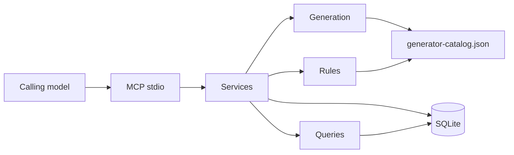

# Godbound Faction World MCP — Design

> Status: written for an autonomous session. Decisions below are locked so an implementer does not have to invent them. Challenge any locked decision before implementation if it is wrong; do not leave it implicit.

## Purpose

This MCP constructs and runs one campaign world whose large-scale actors follow the Godbound procedures for courts, facts, Influence, Dominion, cults, and factions. It does three jobs:

1. **Populate** the setting when a campaign is created, and again during play whenever a setpiece, character, or fact is needed and is not already stored.
2. **Update** stored state by applying those procedures, including dice, costs, collapse, and faction turns.
3. **Answer** from stored state: costs, who must be convinced, why a check failed, what a faction turn changed, and which problems are still faceless adventure hooks.

Adding an element always accepts a full description. Any field the caller omits is filled from the generator catalog, unless the caller asked for a blank that must stay unnamed.

Ruin layout is out of scope. The challenge kind `clear_danger` exists as an adventure card (what goes wrong around a dangerous place). The server never generates a ruin's original purpose, hazards, rewards, inhabitants, or rooms.

The generator catalog is original short prompts with the same die sizes and situation categories as the procedures. It is not a transcription of the rulebook. Callers may replace any table.

## Approaches

**A. Pure rules engine, thin MCP, SQLite. Recommended.**

Dice, costs, contests, and collapse live in pure functions. Tools either call those functions or refuse. Tables are data. The model that calls the MCP supplies narration and proper nouns; it does not re-roll dice or recompute Trouble. State survives restarts. Every roll is stored.

**B. The MCP calls a language model to fill gaps.**

Prose is flexible and the dice procedures are not. It needs credentials, and two calls with the same inputs do not match. Rejected.

**C. Markdown files the calling model updates.**

Easy to read and easy to play incorrectly. The requirement is that world updates follow the procedures. Rejected as the source of truth. A later export to markdown is fine; it is not the store.

Approach A is the design.

## Locked decisions

| Topic | Choice |
| --- | --- |
| Language | TypeScript, Node 22 |
| MCP | `@modelcontextprotocol/sdk` over stdio |
| Validation | Zod |
| Store | SQLite via `better-sqlite3`, one file per process, WAL |
| Tests | Vitest |
| IDs | UUID v4 |
| RNG | mulberry32, seed is a uint32 stored on the roll |
| Transport v1 | stdio only |
| Derived numbers | Server computes Trouble, action die, collapse, caps, and cost. Clients cannot write them. |
| Table prose | `docs/superpowers/specs/generator-catalog.json` |
| Names | Caller-supplied culture lists. Otherwise `Unnamed {role}`. No setting name-lists ship in the server. |
| Defender AI | `preserve_existence`, overridable per resolution |
| Ally interest | Factions auto-intervene only when interest nature says so, and only after a roll if the spend would flip it |

## Architecture

```text
MCP tools / resources / prompts
        |
        v
application services  (create, ensure, act, quote, brief)
        |
        +--> generation (partial fill, blank, fit)
        +--> rules       (pure)
        +--> queries     (derived, read-only)
        |
        v
SQLite: materialized rows + append-only events and rolls
```

- **Rules** import nothing from the store or the SDK. They take values and an RNG and return results plus roll records.
- **Generation** reads the catalog and the rules. It never overwrites a field the caller sent.
- **Services** open one transaction per tool call, write rows, append events, and return the envelope below.
- **Queries** do not roll and do not write, except `explain_roll`, which only reads.
- **MCP** parses arguments, calls one service, and returns the envelope as text JSON. It also sets `structuredContent` to the same object.



### Response envelope

Success:

```json
{
  "ok": true,
  "data": {},
  "rolls": [],
  "advisories": [],
  "derived": {}
}
```

Failure:

```json
{
  "ok": false,
  "error": { "code": "INSUFFICIENT_DOMINION", "message": "", "details": {} }
}
```

`rolls` includes only rolls created by that call. `advisories` are warnings that did not fail the call (too many major actors, feature count far from Power, interest already over the cap). `derived` is the query slice most relevant to the mutation (faction trouble and collapse, change quote, court decision rule).

Error codes used by the engine:

`CAMPAIGN_NOT_FOUND`, `ENTITY_NOT_FOUND`, `FILL_INCOMPLETE`, `PICK_OUT_OF_RANGE`, `PICK_UNKNOWN`, `COLLAPSED_FACTION`, `INSUFFICIENT_DOMINION`, `INSUFFICIENT_INFLUENCE`, `INSUFFICIENT_WEALTH`, `INTEREST_CAP`, `MODIFIER_EXCEEDS_DIE`, `NO_USABLE_FEATURE`, `FEATURE_NOT_RELEVANT`, `IMPOSSIBLE_FOR_FACTION`, `DEEDS_OUTSTANDING`, `CHALLENGES_OUTSTANDING`, `COHESION_AT_CAP`, `COHESION_ABOVE_POWER`, `INTRINSIC_PROBLEM`, `DUPLICATE_EXTERNAL_TARGET`, `EXTERNAL_BUDGET`, `INTERNAL_BUDGET`, `ALREADY_ACTED_ON_TARGET`, `INTEREST_ALREADY_SPENT`, `PENDING_DEFENDER_CHOICE`, `NOT_PENDING`, `CHANGE_NOT_READY`, `WARD_OUT_OF_RANGE`, `POWER_OUT_OF_RANGE`, `MAGNITUDE_REJECTED`, `NOTHING_TO_SOLVE`, `TURN_ALREADY_OPEN`, `BLANK_FIELD`, `NAME_TAKEN`.

## Domain model

A **campaign** is the root. It has `name`, `month` (starts at 1), `rngSeed` (the master seed; each roll mixes it with a counter), `rollCounter`, and optional `nameLists`: `{ cultureId: string[] }`.

A **place** has `name`, `scope` (`village` | `city` | `region` | `nation` | `realm`), optional `parentPlaceId`, optional `cultureId`, and zero or more **mundus wards**. A ward has `rating` from 1 to 20 and optional `keyHolderIds` (character or Godbound ids who ignore it, plus allies they have attuned). When a change names several places, only the highest ward rating applies. Wards do not affect immediate gifts; the change tools simply do not consult them unless the caller is pricing Influence or Dominion.

A **faction** has:

| Field | Rule |
| --- | --- |
| `power` | Integer 1–5. Changes only through `set_power` or theology. |
| `cohesion` | Starts equal to Power. Never above Power. At 0 the faction is collapsed. |
| `origin` | `existing` (starting Dominion = Power) or `forged` (starting Dominion = 0). |
| `dominion` | Integer ≥ 0. |
| `behavior` | `despotic_tyrant`, `self_absorbed_survivor`, `scheming_manipulator`, `martial_conqueror`, or `directed`. `directed` never auto-picks a goal. |
| `control` | `npc` or `player`. Player-controlled defenders do not auto-resolve attacks. |
| `autoIntervene` | Default true. If false, this faction never spends interest unprompted. |
| `status` | `active` or `collapsed`. |
| `patronGodboundId` | Set when the faction is a cult. |

Action die by Power: 1 → d6, 2 → d8, 3 → d10, 4 → d12, 5 → d20. Scope used when a faction prices its own projects: 1 village, 2 city, 3 region, 4 nation, 5 realm. That mapping is only for faction-paid internal costs. A faction's Power need not match its home place's scope (a guild in a city is Power 1).

**Trouble** is the sum of problem points. If Trouble is greater than or equal to the action die's maximum, the faction collapses. The die maximum is the collapse line described as "equals the faction's maximum action die roll."

A **feature** has `text`, `domain` (`cultural` | `military` | `economic` | `other`), `size` (`normal` | `vast`), `quality` (`normal` | `superior`), `magical` (boolean), `origin` (`native` | `improbable` | `impossible`), optional `aimedAtFactionId`, optional `covert` (boolean), and `parts[]`. A feature is usable while any part remains. It is ruined when every part is destroyed or the whole feature is sacrificed. A newly created feature has one part whose text equals the feature text. Adding a part does not create a second feature.

A **problem** has `text`, `points` (integer ≥ 1), `domain` (`cultural` | `military` | `economic` | `other`), `intrinsic` (boolean), `external` (boolean), `resistance` (boolean), optional `faceCharacterId`. Intrinsic problems are cult holy laws. They cannot be reduced by Enact Change or by a PC override. Their point total is recomputed when cult Power or harshness changes.

**Interest** is a directed edge `fromFactionId → toFactionId` with `points` and `nature` (`alliance`, `rivalry`, `trade`, `marriage`, `spies`, `aid`, `tribute`). The cap on gaining points is twice the **owner's** action-die maximum. A village (d6) cannot rise above 12. Points already stored above the cap after a Power drop remain spendable; Extend Interest refuses to add more. There is no edge to self.

A **character** has `name` (nullable while blank), `role`, optional `courtId`, optional `factionId`, optional `problemId`, `powerSource` (nullable), `side` (`protagonist` | `antagonist` | `neutral` | `unaffiliated`), `isLeader`, `isHiddenController`, `sharesAuthority`, `minorRelationship` (nullable), and optional `statNote` (free text the caller supplies; the server does not invent combat statistics).

A **court** has `type` (the six catalog types), `powerStructure`, `atmosphere`, `placeId` (nullable until fitted), `rulesFactionId` (nullable), `blank` (boolean), one or more conflicts, one or more destruction consequences, one or more defenses, and its actors. A conflict has `text`, `fittedSummary` (nullable while blank), `protagonistId`, `antagonistId`. Consequence and defense rows have `text` and optional `statNote`.

`court.disposition` toward a Godbound or faction is `untouched`, `favor`, or `control`. Favor is a recorded cooperation. Control means the court has been subverted. If the court rules a faction, control also sets that faction's `contestedControl` and, unless the caller passes `prepared: true`, adds a 2-point cultural problem: "Usurpers and restorationists are moving against the new hand on the court." Control does not by itself rewrite the faction's patron.

A **fact** has `subject` (`place` | `faction` | `character` | `court`), `subjectId`, `statement`, `kind` (`explicit` | `materialized` | `change` | `vanity`), `sourceChangeId`, `supersededBy`. Current facts are those with `supersededBy` null. Replacing a fact inserts a new row and points the old row at it.

A **Godbound** has `name`, `level` (integer ≥ 1), `words` (string labels only), `influence` (pool, default `1 + level`), `dominion`, `wealth`, `divinity` (`none` | `free` | `cult`), `cultFactionId`. Influence in the pool is uncommitted. Commitments live on changes. Wealth is the currency that can be converted into Influence, not Dominion.

A **change** is a project:

| Field | Meaning |
| --- | --- |
| `scope` | village, city, region, nation, realm |
| `magnitude` | plausible, improbable, impossible, vast |
| `kind` | `feature`, `fact`, `problem_mitigation`, `creature_population`, `champion`, `other` |
| `placeIds` | Places whose wards apply |
| `factionId` | Faction the change lands on, if any |
| `owner` | `pc` or `faction` |
| `status` | `pending`, `active`, `decaying`, `resolved`, `failed` |
| `dominionSpent` | Stays spent even if Influence is withdrawn |
| `deedsRequired`, `deedsDone` | Mighty deeds still owed |
| `challengesRequired`, `challengesDone` | Challenge cards still owed |
| `featureId` | Set when a feature project completes |
| `backlashProblemId` | The 1-point problem created with a new feature |

Commitments on a change: `{ godboundId, influence, wealthSpent }`.

A **resister** on a change has `rating` (use 1, 2, 4, 6, or 8 as the usual bands: minor spirit or angry priest; skilled mage or strong local ruler; eldritch or major beast; minor parasite god or fresh Godbound foe; major parasite god or veteran Godbound foe) and a label. Any positive integer rating is accepted so the GM can record an unusual foe. Multiple resisters: use the worst rating, then +1 for each resister beyond the first. They stack with the ward.

A **challenge** card has `kind` (the ten catalog keys), `text`, `changeId`, `status` (`open` | `overcome`). `clear_danger` is only this card.

A **setpiece** has `key` unique per campaign, `need` (`court` | `challenge` | `character` | `fact` | `problem_face`), optional links, and `status` (`ready`). `ensure_*` with the same key returns the existing row.

A **faction turn** has `month`, `sequence` (more than one turn can happen in a month), shuffled `order`, and child **actions**. An action stores its type, actor, target, feature ids, trouble or contest rolls, outcome, and dominion delta.

An **event** is append-only: `type`, `payload` JSON, `turnId`, `createdAt`. Rumors are rendered from events, not from a second prose store.

## Generation contract

Every create and ensure tool takes:

```ts
type FillMode = "require" | "missing" | "blank";

interface GenerateInput {
  fill?: FillMode;          // default "missing"
  seed?: number;            // uint32; omitted → crypto random, always returned
  pick?: Record<string, number | string>;
}
```

`pick` keys are catalog paths such as `courts.aristocratic.conflict` or `features.military`. A number is a 1-based row. A string is matched against the row text, case-insensitive, or against a power-structure / goal / interest id. Unknown keys and out-of-range numbers fail with `PICK_UNKNOWN` or `PICK_OUT_OF_RANGE`. A picked row is logged with `forced: true` and does not consume randomness.

### Modes

| Mode | Behavior |
| --- | --- |
| `require` | Every field the entity needs from the caller is present. No catalog roll. Derived fields are still computed. Missing fields → `FILL_INCOMPLETE` with the field list. |
| `missing` | Caller values are kept. Null or omitted fields are rolled once and stored. Later calls do not reroll stored fields. |
| `blank` | Same as `missing`, except name, `fittedSummary`, and fact statements that would invent proper nouns stay null. `blank` is legal on courts, characters, and facts. It is rejected on faction turns and on rule mutations. |

`fit_blank` binds a blank court or character: caller names win; still-null names come from the place's culture list, else `Unnamed {role} {n}`; `fittedSummary` becomes the caller's sentence or the template `"{protagonist} presses the quarrel ({conflict}). {antagonist} opposes."` Names already used in that campaign are not reused from the list (`NAME_TAKEN` only if the caller sent a duplicate).

### What is derived, never filled from a table

Action die, Trouble, collapse, interest cap, change cost, cohesion ceiling, cult income, uneven-contest bonus. If the caller sends Trouble, action die, or a cost, the service ignores those keys. If the caller sends cohesion above Power, the call fails. Cohesion below Power is allowed on create (the group is already damaged).

### Soft guidelines (advisories, not errors)

- Features: usually about one per Power, give or take one or two. The seeder uses exactly `power` features unless `featureCount` is `power-1`, `power`, or `power+1`. A faction with zero features is legal. The advisory fires when the count is 0 or greater than `power + 2`.
- Problems at creation, by `pressure`:
  - `prosperous`: `Math.round(dieMax / 4)` points (d6 → 2, d8 → 2, d10 → 3, d12 → 3, d20 → 5).
  - `strained`: `Math.round(dieMax / 3)`.
  - `crisis`: `dieMax / 2` when `crisisBand` is `half`, or `Math.ceil(dieMax * 3 / 4)` when `three-quarter`.
- The seeder splits that budget into problems of 1 point, and into a 2-point problem only when the remaining budget is at least 2 and the next rng bit is 1, never exceeding the budget. Each problem is a catalog row of a domain chosen round-robin cultural, military, economic, skipping a row already used in that faction.
- Major actors default to 3, clamped to 2–5 in generated courts. `require` mode may store more than 5 and emits an advisory.
- Minor actors default to 3.

### Court generation order

1. Power structure (d6).
2. Type, if omitted (d6 across the six types).
3. Major actors. After they exist, flags are assigned from the structure:
   - autocratic: exactly one `isLeader`.
   - figurehead: one `isLeader` plus `hiddenControllers` (default 1) distinct `isHiddenController`.
   - shared: the first `leaderCount` (default 2) majors get `sharesAuthority`.
   - consensus and anarchic: no leader flags.
   - democratic: one `isLeader` who still needs a majority.
4. One power source per major actor.
5. One conflict. Protagonist and antagonist are two distinct majors. Every other major is assigned `protagonist`, `antagonist`, or `neutral` by a d3, unless the caller set sides.
6. Minor actors, each with a minor-relationship row.
7. One destruction consequence and one defense, unless counts say otherwise.
8. One atmosphere row from that type's atmosphere table (bureaucratic regard, business condition, community temperament, and criminal main line all use the `atmosphere` field).

Blank courts stop before names and before `fittedSummary`.

### Faction seeding

`seed_campaign` writes a campaign even if the outline is empty. With an outline:

1. Create each place. `scope` is required in `require` mode. In `missing` mode an omitted scope is `village`.
2. Create a faction for each outline entry that asks for one. Default Power from the home place: village 1, city 2, region 3, nation 4, realm 5. An explicit Power wins.
3. Features and problems as above. `origin` defaults to `existing`.
4. If `linkInterests` is true (the default when there are two or more factions), each unordered pair that shares a parent place, or that the outline lists as neighbors, receives a pair of edges. Each side's points equal that side's die maximum (long-term ties), which is under the 2× cap. Nature is rolled from `interestNature` unless provided. The same nature is used on both directions.
5. If `rulingCourts` is true, each such faction gains a court with `rulesFactionId` set. Court type is the entry's `courtType` or a rolled type. The court is not blank unless `fill` is `blank`.

During play, the same create tools accept a single faction, court, character, fact, or challenge. `ensure_setpiece` is idempotent on `key`:

| `need` | Creates if missing |
| --- | --- |
| `court` | A court for `placeId`, type optional |
| `challenge` | One challenge card for `changeId` or a free-floating card of `kind` |
| `character` | A character; role rolled from the court's major or minor table if a court is linked, otherwise role text is required in `require` mode and becomes "Local figure" in `missing` mode |
| `fact` | A fact. `missing` mode requires a `statement` or a `catalogPrompt` the caller already chose; the server does not invent setting facts from nothing. If `statement` is omitted and fill is `missing`, the call fails `FILL_INCOMPLETE` rather than hallucinating a truth. `blank` stores a fact shell with null statement. |
| `problem_face` | A character linked to `problemId`, role text from a d6 of "the person driving this problem" labels: leader, victim, profiteer, fanatic, outsider, reluctant enforcer. Name rules as above. |

Facts are the exception to "tables fill every gap": a new truth about the world must be supplied, or left blank on purpose. Tables fill kinds, roles, troubles, and colors. They do not silently declare that a village has electricity.

## Rules engine

### Dice

```ts
function rollDie(rng: Rng, faces: 6 | 8 | 10 | 12 | 20): number
```

`rng` yields a uint32. A die of `faces` is `1 + (next % faces)`. Catalog tables whose length is not 6, 8, 10, 12, or 20 (interest natures, backlash rows) use the same formula with `faces = entries.length`. Contests and trouble checks use the faction action die only.

Subseed for a roll: `mulberry32(campaignSeed + rollCounter)` then increment `rollCounter` inside the transaction. Passed `seed` on a create call replaces `campaignSeed` for rolls made in that call only, and is written on those rolls.

### Trouble checks

Normal: roll the action die. Success if and only if the roll is **greater than** Trouble. Equal or less fails.

Blame on a failure: walk problems in stored order. Each problem covers a band as wide as its points. Bands are contiguous from 1. The failed roll (which is between 1 and Trouble inclusive, and Trouble equals the sum of points) hits exactly one band. That problem is the culprit. The caller may pass `culpritProblemId` to override. An override that is not one of the faction's problems fails `ENTITY_NOT_FOUND`.

Solve-a-problem check (Enact Change only): success if the roll is **equal to or less than** Trouble. There is no culprit on success. On failure the spent Dominion is lost and no problem shrinks. If Trouble is 0, or the faction has no non-intrinsic problem to name, the service refuses with `NOTHING_TO_SOLVE` and spends nothing. A normal trouble check with Trouble 0 always succeeds, because every face is at least 1.

### Contests

Each side produces a total. Higher total wins. Tie: higher Power wins. Still tied: the defender wins.

A side that names a feature rolls with `featureRoll`:

- If `relevance` is `marginal`, roll the action die twice and keep the lower.
- If `relevance` is `unusable`, the side cannot use that feature (`FEATURE_NOT_RELEVANT`).
- If the kept natural roll is 1, the uneven bonus is 0. Otherwise add the bonus. A defender with no usable feature loses even when the attacker's kept roll is 1: the book result is automatic failure to resist, and the natural-1 rule only suppresses bonuses.
- `relevance` defaults to `direct` when either feature has domain `other` or the caller did not set it. If both domains are set and they differ, default is `marginal`. If the attacker has no feature, Attack and Extend Interest are illegal (`NO_USABLE_FEATURE`). If the defender has no usable feature, the defender loses the contest without rolling.

Uneven bonus of the feature being used, against the opponent's feature (0 if the opponent has none):

- +1 if `size` is `vast` and the opponent is not `vast`
- +1 if `quality` is `superior` and the opponent is not `superior`
- +1 if `magical` is true and `magicRelevant` is not false (default true)
- +1 if `origin` is `improbable`
- +2 if `origin` is `impossible`

Bonuses stack. They are properties of the feature that is rolling, not a comparison of totals.

### Collapse

After every mutation of problems, cohesion, or power, if `status` is `active` and (`cohesion <= 0` or `trouble >= dieMax`), set `collapsed`, append event `faction_collapsed`, and refuse later actions with `COLLAPSED_FACTION`. Queries still work. `record_shatter` stores the caller's outcome sentence as a fact (`splintered`, `conquered`, `abandoned`, or `other`) and optional successor faction ids. It does not un-collapse.

### Change cost

```text
scopeCost = { village: 1, city: 2, region: 4, nation: 8, realm: 16 }
multiplier = { plausible: 1, improbable: 2, impossible: 4, vast: 8 }
ward = max(rating of wards on placeIds), or 0
opposition = 0 if no resisters, else max(rating) + (count - 1)
base = scopeCost + ward + opposition
total = base * multiplier
```

Worked cases the tests must lock:

- Improbable city, ward 4, no resister: base `(2 + 4) = 6`, total `12`.
- Plausible city, ward 4, one resister rated 6: base `2 + 4 + 6 = 12`, total `12`. Improbable total `24`.
- Two resisters rated 8 and 4, no ward, village, plausible: opposition `8 + 1 = 9`, total `1 + 9 = 10`.
- Two wards rated 3 and 10: only 10 is used.

Faction-paid Enact Change and Restore Cohesion do **not** add wards or resisters. Enact Change to create a feature or a vanity fact, or to shrink a problem by one point, costs `scopeCost(factionPower) * multiplier`, default multiplier 1, or 2 if the caller sets `improbable`. Impossible and vast are `IMPOSSIBLE_FOR_FACTION` unless the change has `prepared: true` (the GM states that earlier plausible and improbable work has made the outcome no longer impossible). Restore Cohesion costs `scopeCost * 2` always: 2, 4, 8, 16, 32 across Power 1–5. That matches a village at 2 and a realm-sized empire at 32.

PC and Godbound projects use the full formula. Allies may add Influence or Dominion. A faction may add Dominion to a PC project only through Aid an Ally, and only when the project's magnitude is plausible or improbable.

Default deeds and challenges when the caller does not override:

| Magnitude | Scope | deedsRequired | challengesRequired |
| --- | --- | --- | --- |
| plausible | village or city | 0 | 0 |
| plausible | region, nation, realm | 0 | 1 |
| improbable | village or city | 0 | 0 |
| improbable | larger | 0 | 1 |
| impossible | village or city | 1 | 1 |
| impossible | region | 1 | 2 |
| impossible | nation | 1 | 3 |
| impossible | realm | 1 | 6 |
| vast | any | same deeds as impossible, challenges at least 2 | |
| creature_population and impossible or vast | any | `scopeCost` deeds (1, 2, 4, 8, or 16) | equal to deeds |

`petty: true` on an impossible village-scope change sets both counters to 0. An explicit `deedsRequired` or `challengesRequired` always wins, including zero.

A champion is not this formula. `create_champion` spends a flat **8** Dominion from one Godbound. Derived stat block stored as numbers, not narrated combat:

```text
effectiveLevel = loyal ? ceil(level / 2) : level
hitDice = 5 + 2 * effectiveLevel
attacks = ceil(effectiveLevel / 3)
actions = ceil(effectiveLevel / 5)
damage = "1d8" per attack
effort = effectiveLevel
lesserGifts = ceil(effectiveLevel / 3)
```

`loyal` defaults to false. The note "fractional levels round up" is why division uses `ceil`.

Mortal populations are changes of kind `creature_population`. The quote also returns the hit-die guideline `2 + ceil(level / 2)` and states that Godbound and other powerful supernatural creatures are not valid targets (`MAGNITUDE_REJECTED` if `targetClass` is `godbound` or `supernatural`).

Heritable impossible or vast changes store `heritage` as `area` or `population`, chosen by the caller, default `area`. The server does not track individual offspring. The fact statement records which limit applies.

### Wealth into Influence

Wealth never becomes Dominion. The cost of the next Influence point is one higher than the last, starting at 1. Three points cost 6 wealth. A pool of 3 wealth buys 2 Influence and leaves 0. Leftover wealth that cannot buy the next point is not spent. Several Godbound contribute into one pool first; the triangular cost is on the total, so three Godbound each putting in 1 wealth produce 2 Influence, not 3.

```ts
function influenceFromWealth(wealth: number, want?: number): { influence: number; wealthUsed: number }
```

If `want` is set, spend exactly `want * (want + 1) / 2` or fail `INSUFFICIENT_WEALTH`.

### Influence and Dominion together

`covered = dominionSpent + sum(commitments.influence)`. The project may move from `pending` to `active` only when `covered >= total`, `deedsDone >= deedsRequired`, and `challengesDone >= challengesRequired`. Withdrawing Influence does not refund Dominion. If coverage then drops below `total`, status becomes `decaying` and the feature, if any, is flagged `maintained: false`. A later commitment of the difference can return it to `active` without repaying Dominion already spent.

`assess_withdrawal` does not mutate. It reports:

- `opposed`: resisters still on the change, or a faction with `rivalry` or `spies` interest in the target
- `beyond_local_maintenance`: feature origin is `improbable` or `impossible`, or magnitude was improbable or worse
- `persists_uncontrolled`: kind is `fact` or `other` and the statement was an event (caller sets `event: true`)

`resolve_withdrawal` requires a decaying change and a choice:

- `undo`: supersede the change's fact and, if it created a feature, ruin that feature
- `leave_fragile`: add a 1-point problem
- `stable`: set status `resolved` and leave the feature in place, `maintained: true`

The player is warned by `assess_withdrawal` before they withdraw; `commit` returns the assessment preview whenever the new coverage would still depend on Influence (`dominionSpent < total`).

### PC feature backlash

When a PC-owned change completes and creates a feature, the faction gains exactly one new 1-point problem. Text is the caller's `backlash` or the next `backlash` catalog row. This is not a trouble check. Faction Enact Change has its own success backlash and does not stack a second PC backlash.

`apply_outcome` is the adventure override: no dice. It may remove a feature, remove one part, reduce a non-intrinsic problem by any number of its points, or add a feature. Adding a feature still creates the 1-point backlash. Reducing an intrinsic problem fails `INTRINSIC_PROBLEM`.

### Expanding a change

If a new quote has the same scope and the same magnitude as an active change on the same faction and subject, `expand_change` records a child fact and spends nothing. If scope or magnitude grows, the caller pays `max(0, newTotal - oldTotal)` in any mix of Influence and Dominion. Wards and resisters are re-quoted. Deeds and challenges become the maximum of what is already done and what the new quote requires; only the positive difference is still owed.

## Faction actions

A faction may take at most one internal action and at most `power` external actions in a turn, with at most one external action aimed at a given other faction. Spend Interest is not an internal or external action. It may be used once per turn per target faction, including during another faction's action.

| Action | Class | Resolution |
| --- | --- | --- |
| Build Strength | internal | Trouble check. Success: gain `ceil(power / 2)` Dominion. Failure: culprit spoils it, no Dominion, problems unchanged. |
| Enact Change | internal | Pay the faction cost first. Create feature or vanity fact: normal trouble check. Failure: Dominion lost, culprit gains +1 point. Success: the feature or fact appears, and either a named problem gains +1 point or a new 1-point problem appears. Solve: inverted trouble check. Success: named problem −1 point (remove the row at 0). Failure: Dominion lost, problem unchanged. |
| Restore Cohesion | internal | Illegal with no usable feature (`NO_USABLE_FEATURE`) or if cohesion already equals Power (`COHESION_AT_CAP`). Pay the improbable faction cost. Trouble check. Success: +1 cohesion. Failure: Dominion still spent, cohesion unchanged. |
| Aid an Ally | external | Send `n ≥ 1` Dominion to another faction or to a plausible/improbable PC change. Trouble check. Success: transfer. Failure: the Dominion is destroyed, not transferred. |
| Attack Rival | external | Contest using named features. Defender win: no change. Attacker win: defender chooses. |
| Extend Interest | external | Contest like an attack, except a willing target (`willing: true`) succeeds with no roll. Success: +1 interest if under the cap, else `INTEREST_CAP`. No power-difference bonus. |
| Remove Interest | external | Willing (consent) succeeds with no roll and removes 1 point. Otherwise a plain action-die contest, no feature bonus. Remover wins: −1 interest, floor 0. |
| Spend Interest | special | See below. |

Attack outcomes when the attacker wins. Problem damage is `1 + max(0, attackerPower - defenderPower)`. Cohesion loss is exactly 1. Feature sacrifice ruins the **defensive** feature. The defender picks one:

1. Lose 1 cohesion.
2. Sacrifice the defensive feature (illegal if they had none; they already would have auto-lost only if they had no feature, in which case this option is absent and they must pick cohesion or the problem).
3. Take the problem damage as a new 1-or-more-point problem, or stacked onto `problemId` if the caller names one.

NPC default `preserve_existence`: among options that do not collapse the faction, prefer the problem, then cohesion loss, then feature sacrifice. If every option collapses, sacrifice a feature if one exists; otherwise take the problem. Player-controlled defenders with no explicit choice return `PENDING_DEFENDER_CHOICE` and persist a pending action. The pending action is resolved by `resolve_attack` and does not grant a second external action.

Extend Interest uses the same marginal-feature and no-defender-feature rules as Attack (no relevant feature → cannot resist → attacker succeeds) but the only success effect is +1 interest.

### Spend Interest

`timing`:

- `before`: against a pending roll. Modifier `m` costs `m` interest. `m` must be ≤ the spender's die maximum (`MODIFIER_EXCEEDS_DIE`). No Dominion. Applied to the stored roll before it is compared.
- `after`: against a completed roll in the same turn. Costs `m` interest and `m` Dominion. If Dominion is short, the spend does not happen.
- `steal`: transfer up to `m` Dominion from the target to the spender, costing `m` interest. If this happens while the target has a pending action that requires Dominion, re-check the cost after the theft. If they can no longer pay, that action fails and any Dominion they had already put on it is lost.

`m` cannot exceed current interest. One successful spend per target per turn.

Automated intervention, only when `autoIntervene` is true and the edge nature is `alliance` or `aid` (help) or `rivalry` or `spies` (harm): after the raw totals exist and before the outcome is committed, if a modifier of size `m` (1…die max) would change the winner, and the spender can pay the after-roll Dominion, they spend the smallest such `m`. They do not spend before the roll unless a tool call asks them to. Help moves the ally's total up or the ally's enemy's total down, whichever is cheaper, preferring to boost the ally. Harm does the opposite.

### Goal strategies

At the start of an NPC faction's turn, if `behavior` is not `directed` and the caller did not submit an explicit plan, roll 1d10 on that behavior's catalog and run the strategy. If the strategy is already satisfied, roll once more. If the second is also satisfied, take Build Strength if Dominion allows a useful internal action, and no external actions.

If the chosen action needs Dominion the faction does not have, substitute Build Strength for the internal part and drop unpaid external actions. Record `substituted: true`.

| Strategy | Plan |
| --- | --- |
| `glorify` | Enact Change producing a vanity fact at plausible faction scope, with the feature-creation trouble rule. The result is not a feature. |
| `military_defeat` | Attack the neighbor with the most `rivalry` or `spies` interest, else any neighbor, using a military feature (marginal if the only features are non-military). Desired text: a military setback. |
| `eliminate_resistance_problem` | Solve the highest-point problem with `resistance`, else the highest-point non-intrinsic problem. |
| `dissident_feature` | Create a military or cultural feature. Prefer a military catalog row. |
| `expand_reach` | If a neighbor has lower Power, Attack that neighbor. Otherwise Enact Change at improbable magnitude whose result is a feature "Their reach extends into land that had no faction." |
| `no_external_until_hit` | No external actions. Internal: Build Strength. If an Attack against this faction succeeded since the previous turn, this strategy is treated as unsatisfied only for the external ban: it may Attack back using `military_defeat`'s target rule, once. |
| `solve_external_problem` | Solve the highest-point problem with `external`, else the highest non-intrinsic problem. |
| `survival_feature` | Create a military feature. |
| `stockpile` | While `dominion < 2 * power`, the only action is Build Strength. When that holds, the strategy is satisfied and may be rerolled. |
| `bloodless_coerce` | Attack using a non-military feature. If every feature is military, idle externally and Build Strength. |
| `max_interest` | Extend Interest once against the neighbor farthest below the cap, preferring the highest Power neighbor. Further external slots, if any, Extend Interest against other neighbors. Never two extends against one target. |
| `covert_problem` | Attack with a non-military feature, `covert` preferred. |
| `proxy` | If Dominion ≥ 1 and another faction exists, Aid an Ally with 1 Dominion to the other faction with the strongest military feature. Else Extend Interest against the most powerful neighbor. |
| `harmless_feature` | Create a cultural or economic feature with `covert: true`. |
| `cunning_solve` | Same as solve, and the action records a non-military feature as its means. If none exists, idle. |
| `beat_weaker` | Attack the lowest-Power neighbor strictly weaker than self. If none, idle externally. |
| `military_feature_aimed` | Create or add a part to a military feature with `aimedAtFactionId` set to the highest-Power neighbor. |
| `half_interest` | Extend Interest against the preferred invasion target (weaker neighbor, else any) until points ≥ the owner's die maximum. One point per action, so one step per turn. |
| `solve_military` | Solve the highest military problem, else idle. |
| `strip_military_feature` | Attack with a non-military feature. The desired outcome text says the target should lose a military feature. Defender AI is unchanged. |

`directed` factions act only on the explicit action list in `run_faction_turn` or the single-action tools.

### Turn procedure

`run_faction_turn({ factionIds?, advanceMonth? })`:

1. Participating factions default to all `active` factions. Shuffle that list with the campaign RNG.
2. For each faction in that order, build the plan, then resolve actions. Other factions may Spend Interest at the after-roll window during each contest or trouble check.
3. Append the turn row and rumor events, then close the turn.
4. If `advanceMonth` is true, call `advance_month`. Income uses the Power and level values left by the actions just resolved. `advance_month` sees a closed turn, grants Dominion once, and increments `month`.

Explicit actions in the request replace the strategy for that faction. They are validated against the internal/external budget.

`advance_month` increments `month` and grants Dominion:

- Cult patron: `cultPower + extra`. Extra is 0 nominal, 1 sharp, 2 grueling, 3 overwhelming.
- Free divinity: `1 + floor(level / 3)`.
- `divinity: none` grants nothing.

Cult Power is the cult faction's Power. Income is recorded as an event. It does not require the cult to pass a trouble check.

## Cults

A Godbound with `divinity: cult` needs a faction of at least Power 1 created through `form_cult`. The faction's first feature text is the caller's sentence (their values). `origin` is `forged` unless they are adopting an existing faction, in which case problems already on it remain and Dominion already on it remains. A new cult starts with no problems besides holy laws.

Harshness sets an intrinsic problem budget from the **current** die maximum:

| Harshness | Intrinsic points | Extra Dominion per month |
| --- | --- | --- |
| `nominal` | 0 | 0 |
| `sharp` | `ceil(dieMax / 4)` | 1 |
| `grueling` | `dieMax / 2` | 2 |
| `overwhelming` | `ceil(dieMax * 3 / 4)` | 3 |

Die maxima in this game are all even, so grueling is an integer. One intrinsic problem holds the whole budget unless the caller splits points into several intrinsic problems that sum to the budget. On Power change the budget is recomputed. If it grows, add points to the first intrinsic problem or create one. If it shrinks, shrink intrinsic points from the end until the sum matches. Solvable problems are not rescaled.

`set_theology` may change harshness, the feature sentence, and the intrinsic texts. It always costs 1 Power. If Power is already 1, the cult faction collapses instead of becoming Power 0: cohesion becomes 0, status becomes `collapsed`, and the event records `reason: "theology"`. Otherwise Power drops by 1 and cohesion is clamped to the new Power. This occupies the cult faction's internal action. If that faction has already taken an internal action in the open turn, the call fails `INTERNAL_BUDGET` and changes nothing. If no turn is open, the call opens a turn that contains only this internal action and then leaves that turn open.

Worshippers are not tracked one by one. `form_cult` requires the caller to state that at least a village of willing, religiously active mortals exists (`acknowledged: true`), or it fails `FILL_INCOMPLETE`.

`divinity: free` cannot also have a cult. Setting free clears `cultFactionId` and does not delete the faction; the caller must say what happens to it. The switch is rejected unless `gmOverride: true`, matching the rule that the choice is normally fixed after it is made.

## Courts and play

`decision_makers(courtId)` returns:

| Structure | Who must agree for the court to act as a body |
| --- | --- |
| autocratic | The leader |
| figurehead | Every hidden controller. The public leader is identified and marked insufficient. |
| shared | Every character with `sharesAuthority` |
| consensus | Every major actor |
| democratic | A majority count of major actors (`floor(n / 2) + 1`) |
| anarchic | Nobody. Each major actor is returned as an independent approach. The court cannot bind itself. |

`sway_court({ mode: "favor" \| "control", prepared?: boolean })` records disposition. Favor writes a fact and does not add the usurper problem. Control does, as described in the domain section. Crushing a court is `apply_outcome` plus an optional fact from the court's destruction-consequence row; the server does not apply that consequence automatically, because the table is a suggestion the GM picks up. `list_hooks` includes the consequence text so it is not forgotten.

## Derived queries

All read-only.

| Query | Returns |
| --- | --- |
| `get_world_brief` | Month, factions with power, trouble, cohesion, status, collapse margin (`dieMax - trouble`), courts, open changes |
| `get_faction` | Full faction, features, problems with blame bands, interests in and out, cap, remaining room under the cap |
| `get_court` | Court, actors, conflict, decision rule |
| `quote_change` | The cost breakdown, deeds, challenges, whether a faction could pay it |
| `explain_roll` | Faces, natural, kept, bonus, total, trouble target, success, culprit |
| `list_hooks` | Problems with no face, open challenges, decaying changes, blank courts, destruction consequences of courts the PCs have disposition toward, factions within 1 point of collapse |
| `list_rumors` | Template sentences from the latest turn's events. Templates are fixed: "{faction} attempted {action} against {target} with {feature} and {outcome} because {culprit or contest}." No model call. |
| `decision_makers` | Table above |
| `cult_income` | This month's grant for each cult and free divinity, from level and harshness and power, whether or not the month has been advanced |
| `interest_map` | Edges with nature, points, cap |
| `relevant_features` | Features of a faction whose domain matches a requested domain, plus the uneven bonus against a named opposing feature |

Resources mirror these so a client can read without a tool call:

- `world://campaigns/{id}/brief`
- `world://campaigns/{id}/factions/{factionId}`
- `world://campaigns/{id}/courts/{courtId}`
- `world://campaigns/{id}/turns/latest`
- `world://campaigns/{id}/hooks`
- `world://tables/{path}` serves a catalog subtree

Two prompts, both read-only:

- `gm-briefing`: embeds `get_world_brief` and `list_hooks` and tells the model to narrate only what is in the JSON.
- `faction-turn-narration`: embeds `list_rumors` and the raw actions.

## Persistence

One SQLite file, default `./data/campaign.sqlite`, override with `GODBOUND_WORLD_DB`.

Tables: `campaigns`, `places`, `wards`, `factions`, `features`, `feature_parts`, `problems`, `interests`, `characters`, `courts`, `court_memberships`, `conflicts`, `court_consequences`, `court_defenses`, `facts`, `godbound`, `changes`, `change_commitments`, `resisters`, `challenges`, `setpieces`, `turns`, `actions`, `rolls`, `events`.

`court_memberships` carries the actor flags and side. Characters are not stored twice.

Every service call is one transaction. A rule failure rolls the transaction back, including rolls. The error envelope is returned only after rollback, so a failed attack does not consume the external budget or the roll counter. The failed attempt is not an event. Callers that need a log of illegal requests will not find one; the protocol error is the record.

Foreign keys on. JSON columns only for event payloads and roll detail.

## MCP surface

Server name `godbound-world`, version `0.1.0`.

Tools, grouped. Each create/ensure tool accepts the generation fields. Mutation tools do not.

**World**

- `create_campaign`
- `seed_campaign`
- `create_place`
- `create_godbound`
- `advance_month`

**Populate**

- `create_faction`
- `create_court`
- `fit_blank`
- `create_character`
- `create_fact`
- `ensure_setpiece`
- `create_challenge`

**Update**

- `quote_change` (read-only but listed with updates because callers use it immediately before spending)
- `begin_change`
- `commit_resources`
- `withdraw_influence`
- `assess_withdrawal`
- `resolve_withdrawal`
- `record_deed`
- `record_challenge_outcome`
- `expand_change`
- `create_champion`
- `apply_outcome`
- `sway_court`
- `form_cult`
- `set_theology`
- `set_divinity`
- `set_power`
- `run_faction_turn`
- `faction_action` (one action, opens or joins the open turn)
- `resolve_attack`
- `spend_interest`
- `record_shatter`

**Read**

- `get_world_brief`, `get_faction`, `get_court`, `explain_roll`, `list_hooks`, `list_rumors`, `decision_makers`, `cult_income`, `interest_map`, `relevant_features`

`faction_action` is the single-step form of the actions in the table. `run_faction_turn` batches them. Both call the same rule functions.

The campaign has at most one open turn. `faction_action` appends to it and creates it if needed. A second internal action by the same faction in that turn fails `INTERNAL_BUDGET`. A second external action against the same target fails `DUPLICATE_EXTERNAL_TARGET`. External actions beyond Power fail `EXTERNAL_BUDGET`. `run_faction_turn` creates and closes a turn when none is open. If a turn is already open it fails `TURN_ALREADY_OPEN` unless `resume: true`, in which case it automates only factions that have not yet taken an action in that turn, then closes it. `advance_month` fails with `TURN_ALREADY_OPEN` while a defender choice is pending. If a turn is open and nothing is pending, it closes that turn, grants income once, and increments the month. `run_faction_turn` with `advanceMonth: true` is the only other caller, and it invokes this same function after it closes the turn, so income is never granted twice for one month. A pending defender choice counts as the attacker's external action already spent; `resolve_attack` does not spend another.

## Testing

Pure tests, no SQLite, for every worked numeric case in this document: cost examples, wealth, blame bands, contest ties, natural 1, marginal keep-low, interest cap, attack damage by power difference, restore-cohesion prices, cult budgets, free-divinity income, collapse on trouble and on cohesion, inverted solve check, enact-change failure increasing the culprit, PC backlash not stacking on faction enact, champion cost 8 and the level formula.

Store tests use a temporary SQLite file. One integration test runs a scripted faction sequence with forced rolls: a Power 1 faction with trouble 4 fails Build Strength on a 4 and blames the band that contains 4; a PC commits 1 Influence for a plausible village feature and the faction gains one problem; an Attack from Power 2 beating the village offers the defender the collapse-avoiding choices.

Generation tests: `require` fails when a name is missing; `missing` keeps a supplied conflict and rolls only the atmosphere; `blank` leaves names null; a second ensure with the same key does not roll again; `pick` forces a row.

MCP tests start the server in-process with an in-memory transport if the SDK allows it, otherwise spawn stdio and send one JSON-RPC `tools/call`. At least `seed_campaign` and `quote_change` go through that path.

## Out of scope

- Ruin original purpose, hazards, rewards, inhabitants, locations, and maps
- Bestiary statistics and combat resolution
- Word and gift catalogs, miracle resolution, and Effort
- Treasure creation
- Experience
- Paradise
- A web UI
- HTTP transport
- More than one campaign file per process (the file may contain many campaigns)

## File map for the implementation

```text
package.json
tsconfig.json
vitest.config.ts
src/server.ts                 stdio entry
src/mcp/register.ts           tools, resources, prompts
src/domain/types.ts
src/rules/dice.ts
src/rules/cost.ts
src/rules/trouble.ts
src/rules/contest.ts
src/rules/wealth.ts
src/rules/collapse.ts
src/rules/actions.ts
src/rules/cults.ts
src/rules/goals.ts
src/tables/catalog.ts         imports the JSON catalog
src/generate/fill.ts
src/generate/court.ts
src/generate/faction.ts
src/store/db.ts
src/store/repos.ts
src/services/populate.ts
src/services/turn.ts
src/services/change.ts
src/queries/brief.ts
src/queries/rumors.ts
test/rules/*.test.ts
test/generate/*.test.ts
test/services/*.test.ts
test/mcp.test.ts
```

The catalog JSON in this spec directory is copied to `src/tables/catalog.json` at implementation time so the package does not depend on the docs path at runtime.
