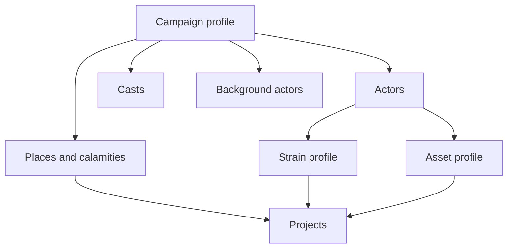

# Agnostic world system

> Status: design, not yet the running server. The current engine implements the Godbound strain profile in [2026-09-21-godbound-faction-mcp-design.md](2026-09-21-godbound-faction-mcp-design.md). This document is the setting-neutral model those rules fold into. It does not transcribe the source books. Numbers below are the rules this system uses.

## Purpose

One campaign world, several flavors. A place, the people who decide things there, and the groups that act once a month should work for a divine realm, a star sector, a kingdom, a collapsed countryside, or one city. The caller supplies the nouns. The server supplies scale, strain, contests, projects, and the turn.

The system has to hold every source that was read, without becoming every source:

| File | What it contributed |
| --- | --- |
| `.docs/GB_Trim.pdf` | *Godbound*, book pp. 103–111 and 126–141. Courts, world-changes, cults, the monthly faction turn. Pages 112–125 are absent. This is the v1 engine. |
| `.docs/GB2_Trim.pdf` | *Sixteen Sorrows*, pp. 4–37. Sixteen community calamities as tags, not a second turn. |
| `.docs/SWN_Trim.pdf` | *Stars Without Number* world tags plus the faction, asset, and goal chapter. |
| `.docs/WWN_Trim.pdf` | *Worlds Without Number* pp. 124–172 (nations through courts) and pp. 323–343 (factions, background actors, major projects). |
| `.docs/CWN_Trim.pdf` | *Cities Without Number* pp. 106–131 and 218–219. Sandbox zoom and org sketches. No faction turn in this excerpt. |
| `.docs/AWN_Trim.pdf` | *Ashes Without Number* pp. 104–135. The same monthly turn as Godbound, aimed at communities, with cheaper large-scale projects and a single opponent. |

## Shape

Three approaches were available.

**A. One actor, two turn profiles, shared places. Recommended.**

Every group that takes a turn is an actor. A campaign picks one profile for all of them: `strain` or `assets`. Places, casts, calamities, and background actors are the same in both. Hero-scale projects are an optional module on top, not a third simulation.

**B. Run both profiles on every actor.**

A city would have cohesion and trouble and also Force, Cunning, Wealth, and a base of influence. The two turns disagree about what "one action" means, and income would be counted twice. Rejected as the default. A later campaign flag `profile: mixed` can attach an asset pool to a strain actor, but only one profile spends the turn.

**C. Keep Godbound as the engine and treat the other books as flavor tags.**

That drops the only procedures that are not already in v1: located assets, attribute contests, background actors, and the city zoom. Rejected.

Profile A is the design. `strain` stays the default because v1 already runs it and because Ashes uses the same skeleton for communities that are not divine.



## Shared world

A **campaign** has a name, a month (starts at 1), a profile (`strain` or `assets`), and these flags. Defaults are the portable reading, not a blend of every optional.

| Flag | Default | What it switches |
| --- | --- | --- |
| `profile` | `strain` | Which turn runs |
| `projectBase` | `scale` | Community projects cost the actor's scale. `scope` uses the 1/2/4/8/16 ladder instead |
| `opposition` | `largest` | Only the single strongest opponent adds to a project. `stack` adds the worst, then +1 per extra |
| `wards` | off | A place rating added to a project's base before the multiplier |
| `heldChanges` | off | Attention can be committed to keep a change in place |
| `capabilityGate` | off | Assets require a setting ladder such as tech level or a magic rank |
| `reachUnit` | `place` | One move is "a neighboring place." `miles` uses about 100 miles. `hex` uses the campaign map |

A **place** has a name, a scope, an optional parent, and up to two tags. Scope is `village`, `city`, `region`, `nation`, or `realm`. Aliases, not new rows: a district is a `village` or `city` with a parent city; a kingdom is a `nation`; a world or sector hex is a `realm` or a `region`. Population, food, and defense are sentences or tag text. They are not tracked numbers.

Each place may hold one **calamity**. It is the Sixteen Sorrows shape, and it is also how a Cities problem or a community tag becomes playable:

| Field | Meaning |
| --- | --- |
| `symptom` | What daily life is like, and the phase: `brewing`, `acute`, or `aftermath` |
| `source` | The specific task that ends it |
| `stake` | Who is hurt, who profits, why people stay |
| `mitigation` | The partial, local, temporary easing a fitting ability always gets |
| `block` | Why one killing or one miracle does not finish it |
| `resolution` | What becomes true after the source is dealt with |

A calamity is not a faction and does not take a turn. Clearing it is an adventure, or a project whose source has been made actionable.

**Tags** on a place or an actor are prompts: enemies, friends, complications, things, and places, a few each. They do not change dice unless the campaign attaches a mechanical tag from the asset profile. Two tags is the normal load. Re-roll or read a tag as a metaphor when it clashes with the setting.

**Zoom**, from Cities, is a generation order rather than a subsystem. Vague pressures at the top, a region with a handful of groups, one starting place written in full, and two to four neighbors sketched. Cap a region near a dozen child places. Invent a new child when play needs a new kind of place. Each scale inherits about two problems; the same problem may be answered differently below it.

**Access** is a relationship. A pass, a bribe, a patron, or a hostile border is a fact or a feature quality (`subtle`, `stealth`, `permission`). There is no access score.

## Actors

An actor is any group the campaign intends to move: a faction, an enclave, a court that rules, a gang, a corp branch, a cult, a government. Kind is a label (`community`, `organization`, `hegemon`) and does not change the math.

Shared fields:

| Field | Rule |
| --- | --- |
| `scale` | 1–5. Sets the action die: d6, d8, d10, d12, d20. Changes only when the fiction says the group has actually grown or broken, not from a routine success |
| `homePlaceId` | Where it can always act |
| `goal` | One sentence, or a catalog goal when the asset profile is on. One goal at a time |
| `control` | `npc` or `player`. Player-controlled defenders do not auto-resolve |
| `status` | `active` or `collapsed` |
| Six facts | Primary activity, style, advantage, unresolved recent event, current goal, name. A branch rerolls event and goal. Cities' generator; usable as seeds for features |

Active actors are capped around six. Everyone else is dormant: they are surviving, and they do not roll. Fewer than three active actors goes quiet; that is a GM warning, not an error.

**Interest** is a directed edge: points and a nature (`alliance`, `rivalry`, `trade`, `marriage`, `spies`, `aid`, `tribute`). Cap is twice the owner's die maximum (12, 16, 20, 24, 40). No edge to self. Long-standing ties start near one die maximum each way. Interest is the strain profile's leverage. In the asset profile it is recorded but not spent; leverage there is a base, a stealthed asset, or a goal.

A group that is not growing is losing ground to rivals and to its own climbers. That is a goal prompt, not a decay roll.

## Strain profile

This is Godbound's faction turn and Ashes' enclave turn, with the conflicts between them called out.

**Cohesion** starts equal to scale, never rises above it, and at 0 the actor collapses. **Features** are sentence-long tools. A feature may have parts; it works until every part is gone. Optional marks, used only for contest modifiers: `vast`, `superior`, `edged` (magic, lost tech, or whatever this setting treats as an unfair advantage), and `origin` (`native`, `improbable`, `impossible`). **Problems** are scored afflictions, usually 1 or 2 points. **Trouble** is the sum. Trouble at or above the die maximum collapses the actor.

Healthy trouble is about a quarter of the die maximum, strained about a third, crisis a half to three quarters. Creation follows that band. A group can legally have zero features; it then cannot resist or restore cohesion.

**Capital** is the spendable means of the group (the sources call it Dominion). An old actor starts with capital equal to its scale. A newly forged one starts at 0. A notably strong one may start at twice scale. Factions and enclaves buy plausible and improbable projects. An impossible project is refused until play has made it at least semi-plausible (`prepared`).

**Turn.** About once a month, faster in a crisis, slower for quiet or huge groups. Random order. Each actor gets one internal action and a number of external actions equal to its scale, at most one external action per target.

Internal:

- **Build strength.** Roll over Trouble. Success yields capital equal to half scale, rounded up (1, 1, 2, 2, 3).
- **Enact change.** Pay the project cost, then roll. Creating a feature needs a roll over Trouble. Success also adds 1 problem point. Failure spends the capital and the blamed problem grows by 1. Shrinking a problem is inverted: success on equal to or under Trouble, and the problem drops by 1. Trouble 0 cannot attempt a fix. Failure spends the capital and does not worsen the problem.
- **Restore cohesion.** Requires a usable feature. Cost is the improbable price of the actor's own scope ladder: 2, 4, 8, 16, 32 across scales 1–5. Ashes states 4 at scale 2 and doubles upward, and does not state scale 1; this system uses 2 at scale 1 so a hamlet can heal. Success restores 1 cohesion. The capital is spent either way.

External:

- **Aid.** Send capital. Roll over Trouble or lose it.
- **Attack.** Contest. The defender with no relevant feature loses. On an attacker win the defender chooses: lose 1 cohesion, ruin the defending feature, or take the change as problem points equal to 1 plus the attacker's scale minus the defender's when the attacker is larger.
- **Extend interest.** Same contest. A willing target grants the point without a roll. One point, up to the cap.
- **Remove interest.** One point. Consent succeeds without a roll.

**Spend interest** is not one of the budgeted actions. Once per target per turn, even during another actor's action: steal that much capital, or shift a trouble check or contest by that much, and never by more than the spender's own die maximum. Help or hindrance declared before the roll costs interest only. Declared after the roll, it also costs an equal amount of capital. Ashes states the hinder option explicitly; Godbound states the shift. Both are allowed.

**Contest.** Higher action die wins. Tie goes to the higher scale, then to the defender. A marginal feature is rolled twice, keeping the lower. A natural 1 suppresses the uneven bonus. The bonus, for the feature that is rolling: +1 vast against a feature that is not, +1 superior against one that is not, +1 edged when the edge matters, +1 if the feature's origin is improbable, +2 if impossible.

**Blame.** On a failed roll-over check, walk problems in order. Each problem covers a band as wide as its points. The face that failed names the culprit.

**Adventures override the turn.** Destroying what a feature depends on deletes it. A player-character job can be ruled as one or more actions that succeed without a roll and without capital: one for a scene, two for a solid favor, three or four for a long or hard job. A completed job also grants capital equal to the party's average reward for that job, or 3 when no reward scale exists. The turn does not get to veto this.

Godbound's four behavior tables (tyrant, survivor, schemer, conqueror) and a `directed` actor who never auto-picks remain available as goal policies. They are optional. A one-sentence goal is enough.

### Where Godbound and Ashes disagree

| Topic | This system | Parked alternative |
| --- | --- | --- |
| Enact-change cost | `projectBase: scale` costs 1–5, doubled if the project is only marginally plausible | `scope` costs 1, 2, 4, 8, 16 before magnitude. Use that when scale means territory size and a realm-spanning rewrite should be exponentially hard |
| Opposition | The single largest opponent: +1 village notable, +2 town ruler, +4 city-scale leader, +6 multi-city leader, +8 regional tyrant. The opponent who *is* the problem does not count. A marginal project doubles the surcharge | Godbound stacks every resister: worst rating, then +1 per extra, and adds wards before the multiplier |
| Feature backlash | Always +1 problem point | Same in both sources. Kept |
| Interest on the inverted fix roll | Shift adds or subtracts; the fixer still wants a low roll | Neither book special-cases this. Left as ordinary arithmetic |

## Asset profile

This is the Stars and Worlds faction turn, stripped of starships, spell lists, and the named asset catalogs. A campaign that picks `assets` uses this instead of cohesion and trouble.

**Ratings.** Force, Cunning, and Wealth, each 1–8. Hit points are the sum of the rank values below, not a separate pool. You buy ranks in order.

| Rank | Experience to reach it | Hit points it adds |
| --- | --- | --- |
| 1 | — | 1 |
| 2 | 2 | 2 |
| 3 | 4 | 4 |
| 4 | 6 | 6 |
| 5 | 9 | 9 |
| 6 | 12 | 12 |
| 7 | 16 | 16 |
| 8 | 20 | 20 |

Stars computes maximum hit points as 4 plus the experience costs of the three ranks. Worlds sums the hit-point column. This system uses the Worlds sum. A new actor is small (best rating 3–4), medium (5–6), or large (7–8), with the second rating about one lower and the third about three lower. Small actors start near 8–15 hit points, medium near 15–29, large near 29–49. Those bands are the Stars examples under the Worlds formula; do not treat them as a second formula.

**Treasure** is abstract logistics, not coin. Income each turn, before upkeep, is half Wealth plus a quarter of Force plus Cunning, rounded up once. Worlds rounds once; Stars splits the rounding. One rounding is the rule.

**Assets** live in a location. Owning more assets of one rating than you have points in that rating costs 1 treasure each at the start of the turn or the excess is lost. Bases of influence do not count toward the cap. An asset has hit points, a purchase cost, an optional upkeep, an attack line (which rating hits, which rating defends, a damage expression), an optional counterattack, and qualities: `subtle` (may enter where a ruler would refuse), `stealth` (cannot be attacked until revealed or until it attacks), `permission` (a government must allow it), `special` (a triggered ability).

The catalogs of individual assets (cyberninjas, gravtanks, harvesters, temple fanatics, and the rest) are setting packs. They are not in the core. A pack is data: the schema above plus a short ability. See Parked.

**Base of influence.** One per location. Cost is 1 treasure per hit point, up to the owner's maximum hit points. The home base's maximum equals the actor's maximum and updates when ratings change. Damage to a base also damages the actor, capped at the base's remaining hit points. Overflow is ignored. Buying or using assets in a location requires a base there, except that the home location always qualifies while the actor exists. Expanding influence is a Cunning contest against every other actor present; a rival who wins may attack the new base immediately.

**Turn.** Initiative is 1d8, highest first; the GM breaks ties. Stars instead rolls one die no smaller than the faction count and walks the list from that index. This system uses individual initiative because it survives adding and removing actors. Then, for each actor: income, upkeep, asset specials, one action type, goal check. Every asset may perform that one type. Attack means every legal asset may attack. Repair means every asset may be repaired if the treasure is paid.

Actions:

- **Attack.** Same location only. The defender chooses which asset there stands in the way. Each side rolls 1d10 plus the rating named on the attack line. The attacker wins only by exceeding. A tie is a defender win, and both the attack damage and the counterattack apply on a tie only in the Stars rule; Worlds gives the miss and the tie to the counterattack alone. This system follows Worlds: tie or miss, counterattack only; hit, attack damage only.
- **Move.** Any number of assets shift one reach, unless `subtle` or `stealth` is required to enter. One reach is the campaign's `reachUnit`.
- **Repair.** 1 treasure heals half the ruling rating, rounded up. Further repairs on that same asset this turn cost 2, then 3. The actor itself may heal once: the average of its highest and lowest ratings, rounded up.
- **Create asset.** One per turn, at a base, meeting the rating and any capability gate.
- **Hide.** Cunning 3+, 2 treasure, not inside a rival base. Grants stealth.
- **Sell.** Half cost, rounded down. A damaged asset yields nothing.
- **Use ability.** Trigger specials. All assets of one kind finish before the next kind, so a transport cannot move an asset away and back around another ability in the same turn.

**Capability gate**, off by default. When on, the campaign names an ordered ladder. Stars uses a tech level. Worlds uses magic ranks None, Low, Medium, High, which do not add hit points and are not rolled. An asset lists the minimum rung. A location can be treated as one rung higher by a feature the campaign defines (a lab, a cache). The ladder's contents are setting data.

**Goals** award experience equal to their difficulty, spent at the start of a turn to buy the next rank, or optionally a new mechanical tag. Abandoning a goal costs the next turn's action and its specials. The portable goal list: blood the enemy (damage equal to the sum of ratings, difficulty 2), destroy the foe (2 plus the average of their ratings), eliminate a named asset within three turns (1; failure does not paralyze), plant a base (1, or 2 if contested), stealth assets in rival locations equal to Cunning (2), destroy a higher-tier Force asset (2), four turns without an attack (1), root out a rival base (half the average of the local ruler's ratings, rounded up), dominate one rating by destroying that many assets of that kind (half the count, rounded up), spend four times Wealth on bribes (2, and Wealth must rise before it can be chosen again).

**Mechanical tags**, at most one, plus a second only when it is "rules a place." They are the dice tricks that travel, renamed off their source justifications:

| Tag | Effect |
| --- | --- |
| `concealed` | New assets start stealthed |
| `expansive` | One expand-influence attempt per turn is free |
| `innovative` | May buy as if two ratings were 2 higher, and may hold at most two such assets |
| `sharp` | Extra die on the rating that is already the highest. The tag names which rating |
| `massive` | If your rating is more than twice the opponent's, the check is an automatic win unless they are also massive |
| `mobile` | Reach doubled |
| `populist` | Assets costing 5 or less cost 1 less, minimum 1 |
| `rooted` | Extra die at home. Rivals there roll twice and take the worse |
| `scavenger` | Destroying an asset yields a quarter of its cost, rounded up |
| `supported` | Each damaged asset except bases heals 1 at the turn's start |
| `tenacious` | A base reduced to 0 stays at 1, once, until fully repaired |
| `zealot` | One failed attack per turn may be rerolled, and the counterattack still lands |
| `ruler` | Permission-gated assets need this actor's consent on each place it rules. May be acquired more than once |

Extra dice: roll them and keep the highest.

**Adventures override assets the same way.** A played outcome creates or destroys an asset, or moves treasure, with no attack roll. The effect should be at least what one faction action could have done.

**Mergers** are a compatibility check, not a formula to optimize. Rate how well the two groups fit from 1 to 9. For each rating, roll 1d10; equal or under keeps the higher score, over keeps the lower. Each asset is kept or sold on the same roll. Treasure is summed. Pick a new goal. This is optional and easy to leave unused.

## Projects

One pricer, used by strain actors and by player ambitions. Asset actors do not pay this for buying assets; they pay treasure. They may still pursue a project as a goal, and a faction action can cut a project's remaining difficulty.

```text
base = projectBase == scale ? actor.scale : scopeCost[scope]
magnitude = plausible 1, improbable 2, impossible 4
opposition = largest resister, or worst + (count - 1) when opposition is stack
ward = highest place ward, or 0 when wards are off
total = (base + ward + opposition) * magnitude
```

Scope costs when `projectBase` is `scope`: village 1, city 2, region 4, nation 8, realm 16. A marginal strain project doubles the total. Impossible magnitude is legal for a hero project and illegal for an actor unless `prepared`.

Worlds' major-project ladder is a different curve: a 1/2/4 magnitude times a scope multiplier that starts at ×2 for a village and doubles through the known world, times a single opponent, times two again if the populace hates it. That curve makes adventures the efficient way to buy progress and makes cash a bad shortcut. It is parked as `pricing: venture` rather than the default, because the default must also price a hamlet's militia. When `venture` is on, use that curve for player ambitions only, and keep `scale` pricing for an actor's own enact-change.

**Held changes**, off unless the campaign has heroes who bend the world:

- A gift or a scene is immediate and free.
- **Attention** is committed, not spent. Withdrawing it lets the change decay on a sensible timeline. Pool defaults to 1 plus a personal rating the caller supplies.
- **Capital** makes the result last until an equal spend undoes it or someone destroys the thing that was made.
- Adjustments inside the same scope and magnitude are free. Growth costs the difference.
- Default adventure debt: a wide plausible or improbable change wants one challenge; an impossible change wants one deed plus more challenges as the scope rises (1, 1, 2, 3, 6 from village through realm). The caller may set the debt, including zero.

Wards, when enabled, are a rating from 1 to 20 on a place. Only the highest applies. They raise project cost. They do not block a scene that happens in person. Holding the key ignores the ward.

## Casts

A **cast** is a cluster of people who must deal with each other: a court, a parish, a corp office, a gang. It is not an actor unless someone also gives it a profile.

Build order, shared by Godbound courts, Worlds courts, and the Cities minimum cast:

1. Who decides: one voice, a figurehead with hidden controllers, shared authority, consensus, majority, or unsettled.
2. Two to five people who must be dealt with. Three is the default. More than five warns.
3. Each has a power source. They stay relevant until that source is gone or they are dead.
4. One live conflict: one pushes, one opposes, the rest take a side or can be swayed.
5. A few minor figures tied to that conflict.
6. One consequence if the cast is smashed, and one reason a straight murder is a bad answer.
7. Faces for play: a known leader and a junior who can appear in a job. Officials can exist as people before they have an office.

Coercing a cast is faster than persuading it and rots legitimacy the longer it lasts. Becoming the power behind a ruling cast is a heavier fact than a favor: it marks the ruled actor contested and adds a 2-point problem that someone wants the old arrangement back.

Cities' person generator is the field list for anyone in a cast: a strength scaled to rank, a virtue, a flaw, a problem they want gone, a desire they want, and those four should cause each other.

## Background actors

From Worlds, and from the Cities rule that not every group is a faction. About three at a time. A sentence of holdings and motives. No ratings, no capital, no assets, no initiative.

Once each turn, or between sessions if no actors are active, each background actor gets one visible event in a place the players can hear about. Use a short event list or a fiat sentence. Retire anyone who dies, leaves, or falls outside the campaign. Prefer recent adventure people as replacements.

## Generation

The v1 contract stands. Create and ensure take `require`, `missing`, or `blank`. Caller text wins. Omitted color is rolled from a catalog of original prompts, not from the books. Facts are never invented from a table: the caller states them or leaves them blank.

New catalog groups, still original sentences:

- Calamity phases and the five slots (antagonist, friend, place, thing, complication). The sixteen sorrow types are category keys, not copied entries.
- Actor six-facts: activity, style, advantage, event, goal.
- Background-actor events, one general list.
- Asset-profile goal names. Individual asset stat blocks stay out until a setting pack is added.

Soft warnings, not errors: feature count far from scale, more than five people in a cast, more than six active actors, trouble already in the crisis band at creation.

## What v1 already is

The running server is the strain profile with Godbound's flags turned as follows:

| Agnostic flag | v1 value |
| --- | --- |
| `profile` | `strain` |
| `projectBase` | `scope` for hero changes; faction enact-change uses the scope ladder indexed by power |
| `opposition` | `stack` |
| `wards` | on, as mundus wards |
| `heldChanges` | on, as Influence |
| Cults, Words, champions, free divinity | present |

Those stay valid. They are a preset named `godbound`, not the universal default. A later implementation adds `preset: godbound | ashes | stars | worlds | cities | custom` which only sets the flags and which catalogs load. `cities` loads casts, zoom, and six-facts, and leaves the turn idle until the caller stats an actor. `ashes` is strain with `projectBase: scale`, `opposition: largest`, wards off, held changes off. `stars` and `worlds` are the asset profile; worlds adds the capability gate and background actors.

## Parked

Left out of the core, kept here so they can be picked up as a preset or a pack. "Color" means it is a noun the caller can already type into a feature or a tag. "Pack" means it wants data, not a new procedure. "Preset" means it wants a flag this design already has, turned the other way.

### Godbound

- Words, gifts, and instant miracles. Color, plus the held-change module when a campaign wants the cost.
- Apotheosis, one patron per mortal, apostates who still count, free divinities and their monthly capital, cult harshness bands that mint intrinsic problems. Preset. v1 already runs this. Intrinsic problems are the one mechanic worth keeping if a campaign has laws a group cannot vote away.
- Creature hit dice, Effort, lesser gifts, and the flat 8-capital champion. Preset. The formula does not describe a mayor or a mercenary captain.
- Mundus theology, celestial engines, Night Roads, the Bright Republic, parasite gods, and the named resistance bands (1, 2, 4, 6, 8). The bands are the default labels for `opposition: stack`. The nouns are color.
- Wealth converting to attention on the triangular price 1, 3, 6. Preset, only with held changes. It never buys capital.
- Session experience for heroes. Out of scope for the world turn. The adventure-override rule replaces it at the actor layer.

### Sixteen Sorrows

- The sixteen calamity names as category keys. Pack of prompts, not rules.
- Bestiary math: attacks per hero, hit dice from party level, mob size classes, curse-magic ranks. Color and a combat game this server does not run.
- Arcem factions, the angelic Host, Uncreated Night. Color.
- The rule that a fitting power always gets one local, temporary win. Kept, as the calamity's `mitigation` field. The assumption that the heroes are demigods is not kept.

### Stars Without Number

- The asset catalog by name (capital fleets, panopticon matrices, pretech manufactories, and the rest). Pack. The schema is in the asset profile.
- Tech level as a space-travel fact, spike drives, system hexes, and "planetary government permission" as a sci-fi border. The `permission` quality and `reachUnit: hex` cover the procedure.
- FacCreds cashed out at about 100,000 credits, and the donation cap of 1d4 such bundles a turn. Preset economy. The core keeps treasure abstract.
- Eugenics cults, the Perimeter, the Exchange, psychic academies, the Scream. Color, or a tag in a pack.
- Homeworld relocation that takes one turn per hex and forbids other actions. Pack, if a campaign has a moving capital.
- Starship assets needing a world of several hundred thousand people. Pack constraint on the capability gate.
- The news-chyron use of the turn. Kept, as the existing rumor render. Not a new rule.

### Worlds Without Number

- Magic as None / Low / Medium / High, and every asset whose job is to cast, summon, scry, or unmake sorcery. The gate is the capability flag. The asset list is a pack.
- Silver prices, the 5 percent property tax, hirelings, and the note that 25 Stars credits equal 1 silver. Preset economy.
- Population math: 60 people per square mile, 90 percent rural, capital as a third of the urban tenth. A seeding hint, not a stat. Wastelands that break the density are color.
- Mass combat and the soldier-type list. Out of scope. A fight between assets is the attack action.
- Workings, heritable enchantments at four times cost, and the Gyre. Preset on top of projects, if a campaign wants magic that occupies a place.
- Renown's cash curve (500 per point, then doubling blocks until money stops working) and a faction cutting difficulty by the sum of its ratings. Preset `pricing: venture`.
- Government thickness at about 1 in 300 and 1 in 100. A sentence on the place, useful when someone asks how fast the law arrives. Not a modifier.
- Individual court-tag and ruin-tag writeups. Those pages were not in the trim. Ruin layout stays out of scope, as in v1.

### Cities Without Number

- Heat, turf as a tracked economy, and crew statistics. Not in this excerpt. Turf is an optional fact or a feature. Do not invent a heat track.
- The global, city, and district prompt tables, and the corp and gang color tables. Pack of six-facts and calamity prompts.
- Themes (alienation, commoditization, despair, and the rest). GM instructions, not modifiers. The sex theme needs an explicit agreement at the table before it is used at all; the server should not seed it.
- Cyberware prices, maintenance, Trauma Dice, the ban on full casters taking cyber, and the armor conversion table. A different game's combat. Out of scope.
- Fixers and the first-session hook list. The cast's brokers and the existing setpiece tools. The "at least five hooks after the opener" rule is GM practice, not a stored quota.
- "Scheme" as a corp procedure. Named in the excerpt and not defined there. Left out until a source actually states it.

### Ashes Without Number

- Food stocks, radiation, nanites, zombies, pod-people, uplifted beasts, and the eighty tag names. Color and a prompt pack. Scarcity is a problem with points, not a pantry.
- Psychic cults tied to one setting. The tag says to reskin them. Do that in the prompt pack.
- The worked "After the Fall" scenario. An example, not a rule. It is already expressible: a scale-1 camp attacks a wounded scale-2 town and the town takes a 1-point problem rather than another cohesion hit.

## Implementation note

This document does not change `src/`. The next implementation pass should add the campaign flags and the `ashes` and `cities` presets on the existing strain engine before building the asset profile. The asset profile is a second rules module, not a rewrite of features into hit-point units. Setting packs, if added, are JSON catalogs of assets and tags, swappable the way `src/tables/catalog.json` already is.
