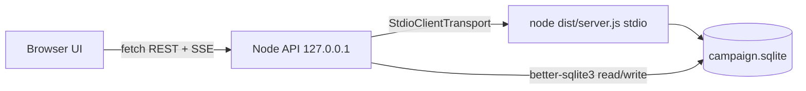

# Dev GUI: MCP tool inspector and campaign DB viewer

> Status: design for [issue #26](https://github.com/horribleCodes/gardener/issues/26). Fast-track slice of roadmap item 29. Does not change MCP tools, rules, or production server behavior.

## Purpose

Give Gardener developers a **localhost browser** to start the real stdio MCP server, call tools/resources/prompts with structured args, inspect JSON envelopes, run ad hoc SQL against the campaign file, and read a unified traffic log—without Cursor, Claude Desktop, or one-off scripts.

This is **dev-only**. It is not roadmap #19 campaign directories, #24 grouped tools, #25 CLI, or the full #29 terminal + config browser.

## Success criteria

| Criterion | How we know |
| --- | --- |
| Real MCP path | Backend spawns `node dist/server.js` with stdio transport (same as `.cursor/mcp.json`), not an in-memory test harness. |
| Tool inspection | Every registered tool is listable; user can submit JSON args and see the parsed envelope JSON in the UI. |
| Resources & prompts | URI templates and prompt args are callable; results render as JSON or message text. |
| Campaign switching | User sets database path; **restart** applies `GARDENER_WORLD_DB` (or repo-relative default `./data/campaign.sqlite`). |
| SQL | Arbitrary SQL against the configured path; results as scrollable table or plain text. |
| Observability | Log pane shows MCP request/response summaries and backend errors with timestamps. |
| Local only | Binds `127.0.0.1`, fixed port, no auth. |

## Non-goals (v1)

- CLI/REPL terminal (issue decisions: log pane instead of roadmap #29 terminal).
- Table editing, migrations UI, or “read-only DB mode.”
- Multi-user hosting, HTTPS, or auth.
- Bundled database explorer (optional follow-up; SQL tab is sufficient for v1).
- Changes to `src/mcp/register.ts`, envelope shape, or `docs/ROADMAP.md`.

## Context in this repo

- MCP entry: `dist/server.js` → `buildServer(dbPath)` in `src/mcp/register.ts`.
- Default DB: `process.env.GARDENER_WORLD_DB ?? "./data/campaign.sqlite"` (`src/server.ts`).
- Tests already use `@modelcontextprotocol/sdk` `Client` + `InMemoryTransport`; the GUI must use **`StdioClientTransport`** against the built server to mirror production clients.
- Registered surface today: ~50 tools, six `world://` resource templates, two prompts (`gm-briefing`, `faction-turn-narration`). Tool results are JSON text inside MCP `content` (Gardener envelope: `ok`, `data`, `rolls`, `advisories`, `derived`, or `error`).

## Architecture

### Recommended approach (chosen)

**Subprocess stdio MCP + small Node HTTP API + static/Vite browser UI**, all under `dev/tools/gui/`.



**Why subprocess (vs in-process `buildServer`):**

| Option | Pros | Cons |
| --- | --- | --- |
| **A. Stdio subprocess** (chosen) | Matches Cursor/Claude; exercises real `server.ts` startup and env; restart = real lifecycle. | Requires `npm run build` when server code changes (acceptable per issue). |
| B. In-process `buildServer` + `InMemoryTransport` | Faster iteration on handlers only. | Hides stdio/env bugs; duplicates connection path used in production. |
| C. Attach to external MCP started by user | No child management. | Poor UX for “start/stop” controls; out of scope. |

**Why not embed MCP in the browser:** MCP SDK stdio client is Node-only; keep a thin backend.

### Process and connection model

- One **MCP child** per API process at a time. `Start` spawns `node <repo>/dist/server.js` with `cwd` = repo root and `env.GARDENER_WORLD_DB` = configured path (absolute or resolved from repo root).
- `Stop` closes the MCP client transport and kills the child (SIGTERM, then SIGKILL after timeout).
- **Changing DB path while running:** UI disables “Apply” until stopped, or prompts “Restart required” (issue: restart required).
- Before first start, API checks `dist/server.js` exists; if missing, returns actionable error (“run `npm run build` from repo root”).

### SQLite access

- SQL tab uses a **separate** `better-sqlite3` connection to the same path as `GARDENER_WORLD_DB`.
- SQLite allows concurrent readers; MCP holds a long-lived connection. Ad hoc `SELECT` is the primary case; `INSERT`/`UPDATE` are allowed but may block briefly—document in GUI README, no special locking UI for v1.
- If the file does not exist, SQL tab may create-on-first-MCP-use (server opens DB) or show empty schema after first successful MCP start; SQL before start returns a clear “set path and start server” message.

### HTTP API (localhost)

Base URL: `http://127.0.0.1:3847` (constant in code; not configurable in v1).

| Method | Path | Body | Response |
| --- | --- | --- | --- |
| GET | `/api/health` | — | `{ ok: true }` |
| GET | `/api/config` | — | `{ dbPath, defaultDbPath, repoRoot, mcpScript }` |
| PUT | `/api/config/db-path` | `{ path: string }` | `{ dbPath }` (fails if MCP running) |
| POST | `/api/mcp/start` | — | `{ status: "connected", serverVersion }` |
| POST | `/api/mcp/stop` | — | `{ status: "stopped" }` |
| GET | `/api/mcp/status` | — | `{ status, serverVersion?, dbPath }` |
| GET | `/api/mcp/tools` | — | MCP `listTools` payload |
| POST | `/api/mcp/tools/call` | `{ name, arguments }` | `{ content, structuredContent?, isError? }` plus parsed `envelope` when content is JSON text |
| GET | `/api/mcp/resources` | — | MCP `listResources` + `listResourceTemplates` |
| POST | `/api/mcp/resources/read` | `{ uri }` | Resource read result |
| GET | `/api/mcp/prompts` | — | MCP `listPrompts` |
| POST | `/api/mcp/prompts/get` | `{ name, arguments }` | Prompt result (messages JSON) |
| POST | `/api/sql` | `{ sql: string }` | `{ columns?, rows?, text?, durationMs }` or error |
| GET | `/api/logs` | — | SSE stream of log events (or WebSocket; pick SSE for simplicity) |

All MCP calls go through a single session mutex so concurrent tool calls do not interleave on one stdio transport.

### Log pane

- Backend appends structured events: `{ ts, level, direction: "mcp"|"sql"|"system", summary, detail? }`.
- Browser subscribes via `EventSource` to `/api/logs` and renders newest-at-bottom with filter chips (All / MCP / SQL / Errors).
- Log retention: ring buffer of last 500 events in memory (no persistence).

## UI layout

Single page, **header** + **main tabs** + **bottom log drawer** (resizable).

### Header (server controls)

- Connection badge: Stopped / Connecting / Connected (+ server name/version when connected).
- Database path text field + “Save path” (disabled while connected).
- **Start MCP** / **Stop MCP** buttons.
- Link to `dev/tools/gui/README.md` (local file hint in UI copy: “see README in repo”).

### Tabs

1. **Tools** — Searchable list from `listTools`. Selecting a tool shows description, JSON Schema for inputs (rendered as form where types are primitive; fallback JSON editor textarea). “Call” sends `tools/call`; result panel shows pretty-printed envelope JSON and raw MCP content.
2. **Resources** — List templates with URI pattern; form fields for `{campaignId}`, `{factionId}`, etc., built from template segments; “Read” shows JSON/text.
3. **Prompts** — List prompts and arg schema; “Run” shows returned messages (role + text).
4. **SQL** — Monaco or plain textarea (plain textarea for v1 to avoid heavy deps); Run; toggle Table vs Plain text for result sets.

**Not in v1:** separate “output schema” column for tools (MCP does not expose Gardener output schemas per tool; envelope is always JSON in text content).

### Frontend stack

- **Vite** + vanilla TypeScript (no React) under `dev/tools/gui/client/` to keep weight low and avoid new framework conventions in the main app.
- Dev: Vite proxies `/api` → backend port.
- Production-style local run: `vite build` output served as static files from the Node API process.

### Styling

- Minimal CSS: system font, light/dark via `prefers-color-scheme`, adequate contrast for JSON.

## Error handling

| Situation | Behavior |
| --- | --- |
| MCP not started | API 409 with `{ error: "MCP_NOT_RUNNING" }`; UI toast. |
| Build missing | Start fails with `BUILD_REQUIRED` and command hint. |
| Tool returns `isError` | Show envelope either way; highlight `ok: false`. |
| Invalid JSON args | Client-side parse error before call. |
| SQL syntax error | Return SQLite message; log as error level. |
| Child crash | Status → stopped; log stderr tail; offer Restart. |

## Security

- Listen only on `127.0.0.1`.
- No CORS for arbitrary origins (same-origin only).
- No authentication (local dev trust model).
- Do not expose API on `0.0.0.0`.

## Testing (implementer)

- **Manual:** README walkthrough: build, start GUI, start MCP, call `quote_change`, read `world://.../brief`, run `SELECT name FROM campaigns`.
- **Automated (light):** Vitest test that imports the session manager with a **mock transport** or spawns subprocess in CI only if fast enough; minimum: unit test for URI template → concrete URI helper and SQL result formatter. Full browser E2E is optional.

## File layout (target)

```
dev/tools/gui/
  README.md                 # how to run, ports, rebuild note
  package.json              # dev deps: vite, typescript; depends on repo root for sdk/sqlite
  tsconfig.json
  server/
    index.ts                # HTTP + static
    mcp-session.ts          # child process + Client
    sql-runner.ts             # better-sqlite3 helper
    log-bus.ts                # ring buffer + SSE
    uri-template.ts           # fill world:// templates
  client/
    index.html
    main.ts
    styles.css
    tabs/                   # tools, resources, prompts, sql
```

Root `package.json` scripts (names illustrative):

- `gui:build` — build client + compile server TS (or use `tsx` for server in dev only).
- `gui:dev` — concurrent API + Vite.
- `gui` — build then run single-port server.

## Resolved decisions (from issue #26)

| Topic | Decision |
| --- | --- |
| MCP runtime | Built `dist/server.js`; rebuild/restart on server code changes OK. |
| Code location | `dev/tools/gui`; dev-only. |
| UI | Structured callers + log pane; no CLI terminal v1. |
| DB switch | Set path + restart MCP. |
| Explorer | Out of v1; SQL tab required. |
| Security | Localhost, no auth. |

## Optional follow-ups (not in this plan)

- Database explorer (e.g. lite table browser).
- Persist last-used DB path in `dev/tools/gui/.local-settings.json` (gitignored).
- In-process MCP mode behind env flag for handler-only work.
