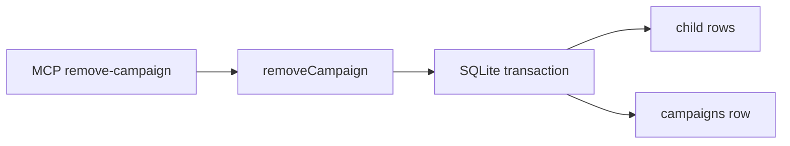

# Remove campaign MCP tool

> Status: design for issue #67. Not implemented on this branch. Living engine docs to update at implementation time: [`docs/design/current-engine.md`](../../../docs/design/current-engine.md).

## Purpose

A director who has a `campaignId` can destroy that campaign and every row that belongs to it, without touching other campaigns in the same SQLite file and without changing play-facing skill files.

Issue #67 already decided the product shape:

- Tool name: `remove-campaign`.
- Input: a campaign id.
- Behavior: remove all data associated with that campaign.
- MCP exposure is sufficient; skill files do not change.
- Living design docs are updated to match.

## Approaches

Three ways to delete a campaign’s graph.

**A. Ordered deletes in one service transaction. Recommended.**

`removeCampaign` in `src/services/populate.ts` (next to `createCampaign`) runs a fixed sequence of `DELETE` statements, then deletes the `campaigns` row. Foreign keys stay `ON`. No `SCHEMA_VERSION` change. New tables later need an extra `DELETE` in this function; a service test that walks `sqlite_master` catches a forgotten table.

**B. `ON DELETE CASCADE` on every foreign key.**

Would need a schema migration (`SCHEMA_VERSION` 3) and would change delete behavior for any future `DELETE FROM campaigns`. Rejected: the issue is one tool, not a storage-model change, and existing files would not pick up cascade without a migration.

**C. `PRAGMA foreign_keys = OFF`, delete the campaign row, turn keys back on.**

Leaves orphan rows. Rejected.

## Shape

### Tool

| Field | Value |
| --- | --- |
| MCP name | `remove-campaign` (hyphens, as issue #67 decided; the rest of the surface uses underscores) |
| Description | `Remove a campaign and all data associated with it` |
| Input | `{ campaignId: string }` — same `campaignId` field name as `create_place` and the other mutating tools |
| Handler | `dbTool((a) => removeCampaign(db, a))` in `src/mcp/register.ts`, registered immediately after `create_campaign` |
| Success `data` | `{ campaignId: string }` — the id that was removed |
| Success `rolls` / `advisories` / `derived` | empty (`[]` / `[]` / `{}`) |
| Missing campaign | `ok: false`, `CAMPAIGN_NOT_FOUND`, message from `requireCampaign` (`campaign ${campaignId} not found`) |

There is no confirmation flag, dry-run, or “are you sure” second call. The caller already has the id.

A second call with the same id fails the same way as an unknown id. Removal is not idempotent.

The SQLite file stays. Only rows for that campaign go away.

### Service

```ts
export function removeCampaign(
  db: Database.Database,
  input: { campaignId: string },
): ServiceResult<{ campaignId: string }>
```

Implementation:

1. `wrapRule` + `withTransaction` (same envelope path as `createCampaign`).
2. `requireCampaign(db, input.campaignId)`.
3. Run the delete list below, binding the campaign id on every statement.
4. Return `{ campaignId: input.campaignId }`.

Do not take the write lock. `create_campaign` does not; the living gap that only queue tools lock is out of scope.

Do not call `PRAGMA foreign_keys = OFF`. Do not bump `SCHEMA_VERSION`.

### What “all data associated with that campaign” means

Every row in the current `src/store/schema.sql` that is reachable from `campaigns.id`:

- Rows with `campaign_id` equal to the id.
- Child rows of those rows even when they have no `campaign_id` (`feature_parts`, `wards`, `interests`, `problems`, `features`, court satellite tables, `change_commitments`, `resisters`, `unit_views`, `actions`).

Interests are associated if **either** endpoint faction belongs to the campaign.

Delete **child tables first**, then parents, so enabled foreign keys succeed. Required order:

1. `feature_parts` (via features of this campaign’s factions)
2. `problems`
3. `interests` (from or to this campaign’s factions)
4. `features`
5. `wards` (via this campaign’s places)
6. `court_memberships` (via this campaign’s courts or characters)
7. `conflicts`, `court_consequences`, `court_dispositions`, `court_defenses`
8. `change_commitments` (via this campaign’s changes or heroes)
9. `resisters`
10. `unit_views` (via this campaign’s turns)
11. `write_queue` (`campaign_id`)
12. `actions` (via this campaign’s turns; before `rolls` because `actions.roll_id` references `rolls`)
13. `setpieces` (before courts, challenges, characters, facts)
14. `challenges` (before `changes`, because `challenges.change_id` references `changes`)
15. `facts`, `characters`, `courts`, `factions`, `places`, `heroes`, `changes`, `rolls`, `events`, `turns`
16. `campaigns`

A later schema table with `campaign_id` or a new child of a campaign-owned parent is in scope for this function when that table lands; the implementer of that table extends this list. This issue does not invent tables.

### Isolation

Two campaigns in one file: removing A leaves B’s campaign row and B’s keyed rows intact. `PRAGMA foreign_key_check` is empty after a successful remove.

### Errors

| Situation | Result |
| --- | --- |
| Unknown `campaignId` | `CAMPAIGN_NOT_FOUND` before any delete |
| Empty string `campaignId` | same (`requireCampaign` finds no row) |
| FK or unexpected SQLite failure mid-delete | transaction rolls back; `wrapRule` / `runDbTool` surface as today (`RuleError` or unexpected envelope) |

No new error codes.

## Out of scope

- `user/` skill files and play manuals.
- Listing campaigns, recovering a lost id, or deleting the SQLite file.
- Confirmation UX, undo, or trash.
- `ON DELETE CASCADE` and schema version 3.
- Taking the write lock on this mutation.
- Historical specs under `docs/superpowers/` other than this document and its plan.
- Broader world/campaign authoring UX.

## Docs at implementation time

Update living design only:

- [`docs/design/current-engine.md`](../../../docs/design/current-engine.md): tool count 48 → 49; in **Campaigns and the database file**, say `remove-campaign` deletes a campaign and every row keyed to it, and that the file still holds any remaining campaigns. Keep the sentence that no tool lists campaigns.
- Do not add a “known engine gap” for this tool once it exists.
- Do not edit `user/skills/**`.
- Do not rewrite historical superpowers specs.

## Testing

Service tests in `test/services/remove-campaign.test.ts`:

- Unknown id → `CAMPAIGN_NOT_FOUND`, no writes.
- Empty campaign (`createCampaign` only) → campaign row gone.
- Seeded campaign plus extra graph (hero, change + resister + commitment, setpiece, open turn / unit view / write queue if cheap to create) → no leftover rows for that id; `foreign_key_check` empty.
- Second campaign in the same file survives with unchanged counts.

MCP test in `test/mcp.test.ts`: `listTools` includes `remove-campaign`; calling it with a created id returns `ok: true` and `data.campaignId`; a later `get_world_brief` for that id is `CAMPAIGN_NOT_FOUND`.

No GUI tests. No skill-file tests.

## Architecture



Domain rules do not gain a “remove campaign” procedure. Persistence coordination stays in the service. The MCP layer only registers the tool.
